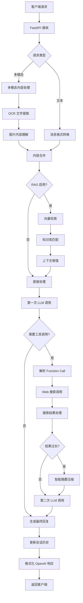

# vivo BlueLM OpenAI-Compatible API Server 🚀

一个功能完整的基于 vivo BlueLM 大模型的 OpenAI 兼容 API 服务器，专为购物反诈场景设计，集成多模态处理、RAG 检索增强、智能 Web 搜索、会话管理等企业级功能。


## 📋 目录

- [🚀 核心特性](#-核心特性)
- [💡 应用场景](#-应用场景)
- [📋 系统要求](#-系统要求)
- [🛠️ 快速开始](#️-快速开始)
- [📚 完整 API 文档](#-完整-api-文档)
- [🏗️ 系统架构](#️-系统架构)
- [🔧 高级配置](#-高级配置)
- [🧪 使用示例](#-使用示例)
- [🛡️ 安全与最佳实践](#️-安全与最佳实践)
- [🚀 生产环境部署](#-生产环境部署)
- [📊 监控与运维](#-监控与运维)
- [🔧 故障排除](#-故障排除)
- [📈 扩展开发](#-扩展开发)
- [🤝 贡献指南](#-贡献指南)

## 🚀 核心特性

### 🎯 专业反诈能力
- **智能风险评估**：基于丰富的反诈知识库，自动识别虚假购物、投资理财、冒充公检法等多种诈骗类型
- **多维度风险分析**：从价格合理性、平台可信度、付款方式、商品描述等多个维度进行综合评估
- **星级风险评分**：提供 0-10 星的直观风险评分系统，帮助用户快速判断风险等级

### 🔌 完整 OpenAI 兼容
- **标准 API 格式**：完全兼容 OpenAI GPT API 规范，支持无缝迁移
- **多模型支持**：支持 `vivo-BlueLM-TB-Pro` 和 `vivo-BlueLM-V-2.0` 多个模型
- **流式响应准备**：预留流式响应接口，便于后续扩展

### 🖼️ 先进多模态处理
- **智能 OCR 提取**：高精度图片文字识别，支持多种图片格式
- **深度图片理解**：详细分析图片内容，包括场景、物体、文字、风格等
- **多格式支持**：兼容 base64、URL 等多种图片输入格式

### 🧠 RAG 检索增强生成
- **专业知识库**：基于数千条反诈案例构建的向量知识库
- **语义检索**：使用 m3e-base 模型进行高质量语义相似度匹配
- **动态上下文**：实时检索相关知识，增强模型回答的准确性和专业性

### 🌐 智能 Web 搜索
- **多搜索引擎**：集成标准搜索、搜狗、夸克、必应等多个搜索引擎
- **智能摘要**：自动压缩长搜索结果，保留核心信息
- **实时信息**：获取最新的产品价格、平台评价等实时信息

### 💬 高级会话管理
- **多用户隔离**：支持多用户并发，会话数据完全隔离
- **历史记录**：智能管理对话历史，支持上下文连续对话
- **用户画像**：根据用户类型（学生、老师、开发者等）提供个性化服务

## 💡 应用场景

### 📱 消费者保护
- **购物咨询**：分析商品价格是否合理，识别低价诱骗
- **平台验证**：评估电商平台、社交平台的可信度
- **支付安全**：识别不安全的支付方式和转账要求

### 🏢 企业风控
- **员工培训**：为企业员工提供反诈意识培训
- **风险预警**：实时监测和预警潜在的诈骗风险
- **合规检查**：协助企业进行交易合规性检查

### 🎓 教育科研
- **反诈教育**：为学校和教育机构提供反诈教育工具
- **案例研究**：支持反诈相关的学术研究和案例分析
- **数据分析**：提供诈骗趋势分析和统计数据

## 📋 系统要求

### 基础环境
- **Python**: 3.8+ (推荐 3.9+)
- **操作系统**: Windows 10+, Ubuntu 18.04+, macOS 10.15+
- **内存**: 最低 4GB，推荐 8GB+
- **存储**: 最低 2GB 可用空间

### Python 依赖
```bash
fastapi>=0.104.1
uvicorn[standard]>=0.24.0
pydantic>=2.0.0
numpy>=1.21.0
requests>=2.28.0
python-dotenv>=1.0.0
```

### API 依赖
- **vivo AI 平台账户**：需要有效的 APP_ID 和 APP_KEY
- **Web 搜索服务**：智谱清言 Web Search API（可选）

## 🛠️ 快速开始

### 1. 环境准备

```bash
# 克隆项目
git clone <repository-url>
cd server

# 创建虚拟环境（推荐）
python -m venv venv
source venv/bin/activate  # Linux/Mac
# 或
venv\Scripts\activate     # Windows

# 安装依赖
pip install -r requirements.txt
```

### 2. 配置设置

复制环境变量模板并配置：

```bash
cp .env.example .env
```

编辑 `.env` 文件：

```properties
# vivo AI 平台配置
VIVO_APP_ID=your_app_id_here
VIVO_APP_KEY=your_app_key_here

# API 服务配置
VIVOGPT_API_URI=/vivogpt/completions
VIVOGPT_API_DOMAIN=api-ai.vivo.com.cn

MULTIMODAL_URI=/vivogpt/completions
MULTIMODAL_DOMAIN=api-ai.vivo.com.cn

RAG_API_URI=/embedding-model-api/predict/batch
RAG_API_DOMAIN=api-ai.vivo.com.cn

# Web 搜索配置（可选）
WEB_SEARCH_API_KEY=your_web_search_key
WEB_SEARCH_URL=https://open.bigmodel.cn/api/paas/v4/web_search
```

### 3. 知识库准备

确保知识库文件存在：

```bash
# 检查知识库文件
ls -la knowledge_base_embeddings/all_knowledge_embeddings.json

# 如果文件不存在，请联系项目维护者获取
```

### 4. 启动服务

```bash
# 开发环境启动
python newserver.py

# 或使用 uvicorn（推荐生产环境）
uvicorn newserver:app --host 0.0.0.0 --port 8000 --reload
```

### 5. 验证安装

```bash
# 检查服务状态
curl http://localhost:8000/v1/health

# 测试基础功能
curl -X POST http://localhost:8000/v1/chat/completions \
  -H "Content-Type: application/json" \
  -d '{
    "model": "vivo-BlueLM-TB-Pro",
    "messages": [{"role": "user", "content": "你好"}]
  }'
```

## 📚 完整 API 文档

### 🌐 基础信息

- **Base URL**: `http://localhost:8000`
- **API 版本**: v1
- **认证方式**: Bearer Token（可选，用于访问控制）
- **内容类型**: `application/json`

### 📋 完整端点列表

#### 1. 模型管理

##### 📝 列出可用模型
```http
GET /v1/models
```

**响应示例：**
```json
{
  "object": "list",
  "data": [
    {
      "id": "vivo-BlueLM-TB-Pro",
      "object": "model",
      "created": 1703025600,
      "owned_by": "vivo",
      "permission": [],
      "root": "vivo-BlueLM-TB-Pro",
      "parent": null
    },
    {
      "id": "vivo-BlueLM-V-2.0",
      "object": "model",
      "created": 1703025600,
      "owned_by": "vivo"
    }
  ]
}
```

#### 2. 聊天补全（核心功能）

##### 💬 创建聊天补全
```http
POST /v1/chat/completions
```

**基础文本请求：**
```json
{
  "model": "vivo-BlueLM-TB-Pro",
  "messages": [
    {
      "role": "user",
      "content": "这个iPhone 15只要1999元，靠谱吗？"
    }
  ],
  "temperature": 0.7,
  "max_tokens": 1024,
  "enable_rag": true,
  "rag_top_k": 2
}
```

**多模态请求（图片分析）：**
```json
{
  "model": "vivo-BlueLM-V-2.0",
  "messages": [
    {
      "role": "user",
      "content": [
        {
          "type": "text",
          "text": "这个商品页面有什么问题吗？"
        },
        {
          "type": "image_url",
          "image_url": {
            "url": "data:image/jpeg;base64,/9j/4AAQSkZJRgABAQAAAQ..."
          }
        }
      ]
    }
  ],
  "temperature": 0.8
}
```

**高级配置请求：**
```json
{
  "model": "vivo-BlueLM-TB-Pro",
  "messages": [
    {"role": "user", "content": "分析这个投资平台的可信度"}
  ],
  "temperature": 0.7,
  "max_tokens": 2048,
  "top_p": 0.9,
  "enable_rag": true,
  "rag_top_k": 3,
  "user": "user_12345",
  "extra": {
    "repetition_penalty": 1.02,
    "stop": ["<end>", "结束"]
  }
}
```

**标准响应格式：**
```json
{
  "id": "chatcmpl-8s9xKL2nB5qF8Q2mJ3pA6Y",
  "object": "chat.completion",
  "created": 1703025600,
  "model": "vivo-BlueLM-TB-Pro",
  "choices": [
    {
      "index": 0,
      "message": {
        "role": "assistant",
        "content": "我帮你看了下哈～🔍📱\n\n我的结论是 👉 不可信 🛑❗️\n\n【虚假诈骗程度：⭐⭐⭐⭐⭐⭐⭐⭐⭐ 9/10星】\n\n理由：\n重点 👉 iPhone 15官方售价5999元起，1999元明显远低于市场价\n1. 这个价格属于典型的"低价诱骗"诈骗套路\n2. 正规渠道不可能有如此大幅度折扣\n3. 极大概率是虚假发货或仿冒产品\n\n建议：\n千万别买哈～建议只通过苹果官网、官方授权店或知名电商平台官方旗舰店购买 👍\n\n别担心，咱们一起留个心眼 👀✨\n\n要不要我再帮你查下这个卖家的其他商品？或者教你怎么识别正规苹果授权店？🤔"
      },
      "finish_reason": "stop"
    }
  ],
  "usage": {
    "prompt_tokens": 156,
    "completion_tokens": 198,
    "total_tokens": 354
  }
}
```

#### 3. 系统监控

##### 🏥 健康检查
```http
GET /v1/health
```

**响应示例：**
```json
{
  "status": "healthy",
  "timestamp": 1703025600,
  "rag_available": true,
  "active_sessions": 12,
  "system_info": {
    "rag_initialized": true,
    "knowledge_base_size": 8942,
    "embedding_model": "m3e-base",
    "search_engines": ["search_std", "search_pro_bing", "search_pro_sogou"]
  },
  "version": "1.0.0",
  "uptime_seconds": 3600
}
```

##### 📊 服务器统计
```http
GET /v1/stats
```

**响应示例：**
```json
{
  "active_sessions": 12,
  "total_messages": 1847,
  "total_requests": 924,
  "rag_status": "available",
  "rag_queries_today": 156,
  "knowledge_base_entries": 8942,
  "search_queries_today": 89,
  "average_response_time_ms": 1250,
  "error_rate_24h": 0.02,
  "top_risk_categories": [
    {"category": "虚假购物、服务类", "count": 234},
    {"category": "虚假网络投资理财类", "count": 89},
    {"category": "冒充公检法及政府机关类", "count": 45}
  ]
}
```

#### 4. 用户管理

##### 👤 用户会话信息
```http
GET /v1/sessions/{user_id}
```

**响应示例：**
```json
{
  "user_id": "user_12345",
  "session_start": 1703025600,
  "message_count": 15,
  "last_activity": 1703029200,
  "user_type": "学生",
  "risk_queries": 8,
  "avg_risk_score": 4.2
}
```

### 📋 参数详细说明

#### 聊天补全参数

| 参数 | 类型 | 必需 | 默认值 | 说明 |
|------|------|------|--------|------|
| `model` | string | ✅ | - | 使用的模型名称 |
| `messages` | array | ✅ | - | 对话消息列表 |
| `temperature` | float | ❌ | 0.7 | 控制输出随机性 (0.0-2.0) |
| `max_tokens` | integer | ❌ | 1024 | 最大生成 token 数 |
| `top_p` | float | ❌ | 1.0 | 核采样参数 (0.0-1.0) |
| `stream` | boolean | ❌ | false | 是否流式响应（暂不支持） |
| `user` | string | ❌ | - | 用户标识符 |
| `enable_rag` | boolean | ❌ | true | 是否启用 RAG 检索 |
| `rag_top_k` | integer | ❌ | 2 | RAG 检索返回条数 |
| `extra` | object | ❌ | {} | 额外的模型参数 |

#### Extra 参数（高级配置）

| 参数 | 类型 | 默认值 | 说明 |
|------|------|--------|------|
| `repetition_penalty` | float | 1.02 | 重复内容惩罚系数 |
| `stop` | array | [] | 停止生成的标记列表 |
| `top_k` | integer | 50 | Top-K 采样参数 |
| `ignore_eos` | boolean | false | 是否忽略结束标记 |

## 🏗️ 系统架构

### 🧩 核心组件架构

```
┌─────────────────────────────────────────────────────────────────┐
│                        FastAPI Gateway                          │
│  ┌─────────────────┐  ┌─────────────────┐  ┌─────────────────┐ │
│  │   Auth & Rate   │  │  Request Router │  │ Response Format │ │
│  │    Limiting     │  │   & Validator   │  │  & Error Handle │ │
│  └─────────────────┘  └─────────────────┘  └─────────────────┘ │
└─────────────────────────────────────────────────────────────────┘
                                │
                                ▼
┌─────────────────────────────────────────────────────────────────┐
│                    Core Processing Engine                       │
│                                                                 │
│  ┌─────────────────┐  ┌─────────────────┐  ┌─────────────────┐ │
│  │   MultiModal    │  │   RAG System    │  │  Function Call  │ │
│  │   Processing    │◄─┤   Retrieval     │◄─┤   & Web Search  │ │
│  │                 │  │                 │  │                 │ │
│  │ • OCR Extract   │  │ • Vector Search │  │ • Auto Function │ │
│  │ • Image Understand│  │ • Semantic Match│  │ • Multi-Engine │ │
│  │ • Base64 Handle │  │ • Context Enrich│  │ • Result Summary│ │
│  └─────────────────┘  └─────────────────┘  └─────────────────┘ │
│                                │                               │
│                                ▼                               │
│  ┌─────────────────────────────────────────────────────────┐   │
│  │              vivo BlueLM Engine                         │   │
│  │                                                         │   │
│  │  ┌─────────────────┐    ┌─────────────────┐           │   │
│  │  │ TB-Pro (Text)   │    │  V-2.0 (Vision) │           │   │
│  │  │                 │    │                 │           │   │
│  │  │ • Text Gen      │    │ • Image + Text  │           │   │
│  │  │ • Function Call │    │ • OCR + Understand │        │   │
│  │  │ • RAG Enhanced  │    │ • Multimodal    │           │   │
│  │  └─────────────────┘    └─────────────────┘           │   │
│  └─────────────────────────────────────────────────────────┘   │
└─────────────────────────────────────────────────────────────────┘
                                │
                                ▼
┌─────────────────────────────────────────────────────────────────┐
│                      Data & Storage Layer                       │
│                                                                 │
│  ┌─────────────────┐  ┌─────────────────┐  ┌─────────────────┐ │
│  │  Knowledge Base │  │ Session Storage │  │   Embedding     │ │
│  │                 │  │                 │  │   Vectors       │ │
│  │ • 8900+ 反诈样本 │  │ • User History  │  │                 │ │
│  │ • Risk Labels   │  │ • Context Track │  │ • m3e-base      │ │
│  │ • Vector Index  │  │ • Multi-User    │  │ • Cosine Sim    │ │
│  └─────────────────┘  └─────────────────┘  └─────────────────┘ │
└─────────────────────────────────────────────────────────────────┘
```

### 🔄 请求处理流程



### 📦 模块详细说明

#### 1. [`newserver.py`](newserver.py) - 核心服务器
**职责**：主应用入口和 API 路由处理
**关键功能**：
- FastAPI 应用初始化和配置
- OpenAI 兼容 API 端点实现
- 请求验证和错误处理
- 多模态消息格式转换
- 会话历史管理
- 响应格式标准化

**重要配置**：
```python
# 会话历史管理
conversation_history: Dict[str, list] = {}
MAX_HISTORY = 100  # 最大历史记录数

# RAG 系统初始化
rag_system_instance = RAGSystem(embedding_client_rag, knowledge_base_rag)
```

#### 2. [`MultiModal.py`](MultiModal.py) - 多模态处理引擎
**职责**：图片内容理解和 OCR 文字提取
**关键功能**：
- 高精度 OCR 文字提取 (`extract_text`)
- 深度图片内容理解 (`interpret_image`)
- Base64 图片数据处理
- 多种图片格式支持

**使用示例**：
```python
# OCR 文字提取
text, error = extract_text(image_base64, temperature=0.1)

# 图片内容理解
description, error = interpret_image(
    image_base64,
    prompt_text="详细描述图片内容",
    temperature=0.9
)
```

#### 3. [`vivogpt.py`](vivogpt.py) - LLM 引擎核心
**职责**：vivo BlueLM 大模型调用管理
**关键功能**：
- 统一的大模型调用接口
- 请求签名和身份认证
- 错误处理和重试机制
- 性能监控和日志记录

**调用示例**：
```python
content, time_cost = ask_vivogpt(
    messages=[{"role": "user", "content": "你好"}],
    model="vivo-BlueLM-TB-Pro",
    extra={"temperature": 0.7}
)
```

#### 4. [`rag.py`](rag.py) - RAG 检索增强系统
**职责**：基于向量的知识检索和上下文增强
**关键组件**：
- `VivoEmbeddingClient`: 向量嵌入生成客户端
- `KnowledgeBase`: 知识库管理和相似度计算
- `RAGSystem`: 完整的 RAG 检索系统

**核心算法**：
```python
def _cosine_similarity(self, query_vec: np.ndarray, doc_matrix: np.ndarray):
    """余弦相似度计算，支持批量处理"""
    query_norm = np.linalg.norm(query_vec)
    doc_norms = np.linalg.norm(doc_matrix, axis=1)
    
    query_normalized = query_vec / query_norm
    doc_normalized = doc_matrix / doc_norms[:, np.newaxis]
    
    return np.dot(doc_normalized, query_normalized)
```

#### 5. [`function_call.py`](function_call.py) - 工具调用管理
**职责**：外部工具调用和 Web 搜索集成
**支持的搜索引擎**：
- `search_std`: 标准搜索
- `search_pro_bing`: 必应专业版
- `search_pro_sogou`: 搜狗专业版
- `search_pro_quark`: 夸克搜索
- `search_pro_jina`: Jina 搜索

#### 6. [`prompt.py`](prompt.py) - 提示词工程
**职责**：专业的反诈提示词管理
**核心提示词特点**：
- 专业的反诈知识整合
- 亲和的客服对话风格
- 明确的风险评分体系
- 结构化的回复格式

#### 7. [`schemas.py`](schemas.py) - 数据模型定义
**职责**：Pydantic 数据验证和类型安全
**主要模型**：
- `ChatCompletionRequest`: 聊天请求模型
- `ChatCompletionResponse`: 聊天响应模型
- `ModelCard`: 模型信息模型
- `UsageInfo`: 使用统计模型

#### 8. [`auth_util.py`](auth_util.py) - 认证工具
**职责**：vivo AI 平台 API 认证
**关键功能**：
- HMAC-SHA256 签名生成
- 请求头构造和验证
- 时间戳和随机数管理

## 🔧 高级配置

### 🌍 环境变量配置

创建详细的 `.env` 配置文件：

```properties
# ===========================================
#           vivo AI 平台核心配置
# ===========================================
VIVO_APP_ID=your_app_id_here
VIVO_APP_KEY=your_app_key_here

# ===========================================
#              API 服务端点配置  
# ===========================================

# 主要对话模型 API
VIVOGPT_API_URI=/vivogpt/completions
VIVOGPT_API_DOMAIN=api-ai.vivo.com.cn

# 多模态模型 API  
MULTIMODAL_URI=/vivogpt/completions
MULTIMODAL_DOMAIN=api-ai.vivo.com.cn

# RAG 向量嵌入 API
RAG_API_URI=/embedding-model-api/predict/batch
RAG_API_DOMAIN=api-ai.vivo.com.cn

# ===========================================
#            Web 搜索服务配置（可选）
# ===========================================
WEB_SEARCH_API_KEY=your_search_api_key
WEB_SEARCH_URL=https://open.bigmodel.cn/api/paas/v4/web_search

# ===========================================
#              服务器运行配置
# ===========================================
SERVER_HOST=0.0.0.0
SERVER_PORT=8000
DEBUG_MODE=false
LOG_LEVEL=INFO

# ===========================================
#               性能优化配置
# ===========================================
MAX_CONCURRENT_REQUESTS=100
REQUEST_TIMEOUT_SECONDS=30
RAG_CACHE_TTL_SECONDS=3600
CONVERSATION_HISTORY_LIMIT=100

# ===========================================
#                安全配置
# ===========================================
ENABLE_API_KEY_AUTH=false
API_KEY_HEADER=X-API-Key
CORS_ORIGINS=*
RATE_LIMIT_REQUESTS_PER_MINUTE=60
```

### ⚙️ 高级功能配置

#### RAG 系统高级配置

```python
# 在 newserver.py 中自定义 RAG 配置
RAG_CONFIG = {
    "top_k": 3,                    # 检索返回数量
    "similarity_threshold": 0.7,    # 相似度阈值
    "max_context_length": 2000,     # 最大上下文长度
    "enable_rerank": True,          # 启用重排序
    "embedding_model": "m3e-base"   # 嵌入模型
}
```

#### 搜索引擎优先级配置

```python
# 在 function_call.py 中配置搜索引擎
SEARCH_ENGINE_CONFIG = {
    "default": "search_std",
    "fallback_order": [
        "search_pro_bing",
        "search_pro_sogou", 
        "search_std"
    ],
    "timeout_seconds": 10,
    "max_results": 10
}
```

#### 模型参数预设

```python
# 常用模型参数预设
MODEL_PRESETS = {
    "conservative": {
        "temperature": 0.3,
        "top_p": 0.8,
        "repetition_penalty": 1.1
    },
    "balanced": {
        "temperature": 0.7,
        "top_p": 1.0,
        "repetition_penalty": 1.02
    },
    "creative": {
        "temperature": 1.0,
        "top_p": 0.9,
        "repetition_penalty": 1.0
    }
}
```

## 🧪 使用示例

### 🐍 Python 客户端完整示例

```python
import requests
import json
import base64
from typing import List, Dict, Any

class VivoAntiScamClient:
    """vivo 反诈 API 客户端"""
    
    def __init__(self, base_url: str = "http://localhost:8000"):
        self.base_url = base_url
        self.session = requests.Session()
        
    def analyze_text(self, content: str, user_type: str = "学生") -> Dict[str, Any]:
        """分析文本内容的诈骗风险"""
        response = self.session.post(
            f"{self.base_url}/v1/chat/completions",
            json={
                "model": "vivo-BlueLM-TB-Pro",
                "messages": [
                    {"role": "user", "content": content}
                ],
                "temperature": 0.7,
                "enable_rag": True,
                "rag_top_k": 3,
                "extra": {"user_type": user_type}
            }
        )
        return response.json()
    
    def analyze_image(self, image_path: str, question: str = "这个图片有什么风险？") -> Dict[str, Any]:
        """分析图片内容的诈骗风险"""
        # 读取并编码图片
        with open(image_path, "rb") as f:
            image_data = base64.b64encode(f.read()).decode()
        
        response = self.session.post(
            f"{self.base_url}/v1/chat/completions",
            json={
                "model": "vivo-BlueLM-V-2.0",
                "messages": [
                    {
                        "role": "user",
                        "content": [
                            {"type": "text", "text": question},
                            {"type": "image_url", "image_url": {"url": f"data:image/jpeg;base64,{image_data}"}}
                        ]
                    }
                ],
                "temperature": 0.8,
                "enable_rag": True
            }
        )
        return response.json()
    
    def batch_analyze(self, contents: List[str]) -> List[Dict[str, Any]]:
        """批量分析多个内容"""
        results = []
        for content in contents:
            result = self.analyze_text(content)
            results.append(result)
        return results
    
    def get_risk_score(self, content: str) -> float:
        """获取内容的风险评分（0-10）"""
        response = self.analyze_text(content)
        
        # 从回复中提取星级评分
        reply = response.get("choices", [{}])[0].get("message", {}).get("content", "")
        
        # 简单的正则提取（实际项目中建议使用更可靠的方法）
        import re
        star_match = re.search(r'(\d+)/10星', reply)
        if star_match:
            return float(star_match.group(1))
        return 0.0

# 使用示例
if __name__ == "__main__":
    client = VivoAntiScamClient()
    
    # 文本分析示例
    print("=== 文本分析示例 ===")
    text_result = client.analyze_text("iPhone 15 Pro Max 只要 1999 元，限时抢购！")
    print(json.dumps(text_result, indent=2, ensure_ascii=False))
    
    # 图片分析示例  
    print("\n=== 图片分析示例 ===")
    # image_result = client.analyze_image("screenshot.png", "这个购物页面靠谱吗？")
    # print(json.dumps(image_result, indent=2, ensure_ascii=False))
    
    # 风险评分示例
    print("\n=== 风险评分示例 ===")
    risk_score = client.get_risk_score("加我微信转账，给你内部优惠价")
    print(f"风险评分: {risk_score}/10")
    
    # 批量分析示例
    print("\n=== 批量分析示例 ===")
    test_cases = [
        "京东官方客服要求你下载app",
        "支付宝新版本更新，请及时更新",
        "投资理财，日收益20%，稳赚不赔"
    ]
    batch_results = client.batch_analyze(test_cases)
    for i, result in enumerate(batch_results):
        content = result.get("choices", [{}])[0].get("message", {}).get("content", "")
        print(f"案例 {i+1}: {test_cases[i]}")
        print(f"分析结果: {content[:100]}...")
        print()
```

### 🌐 JavaScript/Node.js 客户端

```javascript
const axios = require('axios');

class VivoAntiScamClient {
    constructor(baseURL = 'http://localhost:8000') {
        this.baseURL = baseURL;
        this.client = axios.create({
            baseURL: this.baseURL,
            timeout: 30000,
            headers: {
                'Content-Type': 'application/json'
            }
        });
    }

    async analyzeText(content, options = {}) {
        const {
            userType = '学生',
            temperature = 0.7,
            enableRAG = true,
            ragTopK = 2
        } = options;

        try {
            const response = await this.client.post('/v1/chat/completions', {
                model: 'vivo-BlueLM-TB-Pro',
                messages: [
                    { role: 'user', content: content }
                ],
                temperature,
                enable_rag: enableRAG,
                rag_top_k: ragTopK,
                extra: { user_type: userType }
            });
            
            return response.data;
        } catch (error) {
            console.error('分析请求失败:', error.message);
            throw error;
        }
    }

    async analyzeImage(imageBase64, question = '这个图片有什么风险？') {
        try {
            const response = await this.client.post('/v1/chat/completions', {
                model: 'vivo-BlueLM-V-2.0',
                messages: [
                    {
                        role: 'user',
                        content: [
                            { type: 'text', text: question },
                            { 
                                type: 'image_url', 
                                image_url: { 
                                    url: `data:image/jpeg;base64,${imageBase64}` 
                                } 
                            }
                        ]
                    }
                ],
                temperature: 0.8,
                enable_rag: true
            });
            
            return response.data;
        } catch (error) {
            console.error('图片分析失败:', error.message);
            throw error;
        }
    }

    async getHealthStatus() {
        try {
            const response = await this.client.get('/v1/health');
            return response.data;
        } catch (error) {
            console.error('健康检查失败:', error.message);
            throw error;
        }
    }

    async getServerStats() {
        try {
            const response = await this.client.get('/v1/stats');
            return response.data;
        } catch (error) {
            console.error('获取统计信息失败:', error.message);
            throw error;
        }
    }

    extractRiskScore(reply) {
        const match = reply.match(/(\d+)\/10星/);
        return match ? parseInt(match[1]) : 0;
    }
}

// 使用示例
async function main() {
    const client = new VivoAntiScamClient();
    
    try {
        // 检查服务状态
        console.log('=== 服务状态检查 ===');
        const health = await client.getHealthStatus();
        console.log('服务状态:', health.status);
        console.log('RAG 可用:', health.rag_available);
        
        // 文本分析
        console.log('\n=== 文本风险分析 ===');
        const textResult = await client.analyzeText(
            'QQ群里有人说可以代抢演唱会门票，只要500元'
        );
        
        const reply = textResult.choices[0].message.content;
        console.log('分析结果:', reply);
        console.log('风险评分:', client.extractRiskScore(reply));
        
        // 获取服务器统计
        console.log('\n=== 服务器统计 ===');
        const stats = await client.getServerStats();
        console.log('活跃会话:', stats.active_sessions);
        console.log('总消息数:', stats.total_messages);
        console.log('知识库条目:', stats.knowledge_base_entries);
        
    } catch (error) {
        console.error('示例执行失败:', error.message);
    }
}

// 运行示例
if (require.main === module) {
    main();
}

module.exports = VivoAntiScamClient;
```

### 📱 前端集成示例（React）

```jsx
import React, { useState, useCallback } from 'react';
import axios from 'axios';

const AntiScamAnalyzer = () => {
    const [input, setInput] = useState('');
    const [result, setResult] = useState(null);
    const [loading, setLoading] = useState(false);
    const [image, setImage] = useState(null);

    const apiClient = axios.create({
        baseURL: 'http://localhost:8000',
        timeout: 30000
    });

    const analyzeContent = useCallback(async () => {
        if (!input.trim() && !image) return;
        
        setLoading(true);
        try {
            let requestData;
            
            if (image) {
                // 多模态分析
                requestData = {
                    model: 'vivo-BlueLM-V-2.0',
                    messages: [{
                        role: 'user',
                        content: [
                            { type: 'text', text: input || '这个图片有什么风险？' },
                            { type: 'image_url', image_url: { url: image } }
                        ]
                    }],
                    temperature: 0.8
                };
            } else {
                // 文本分析
                requestData = {
                    model: 'vivo-BlueLM-TB-Pro',
                    messages: [{ role: 'user', content: input }],
                    temperature: 0.7,
                    enable_rag: true
                };
            }

            const response = await apiClient.post('/v1/chat/completions', requestData);
            setResult(response.data);
            
        } catch (error) {
            console.error('分析失败:', error);
            setResult({
                error: true,
                message: error.response?.data?.error?.message || '分析请求失败'
            });
        } finally {
            setLoading(false);
        }
    }, [input, image]);

    const handleImageUpload = (event) => {
        const file = event.target.files[0];
        if (!file) return;

        const reader = new FileReader();
        reader.onload = (e) => {
            setImage(e.target.result);
        };
        reader.readAsDataURL(file);
    };

    const extractRiskInfo = (content) => {
        const starMatch = content.match(/(\d+)\/10星/);
        const conclusionMatch = content.match(/我的结论是 👉 (.+?)(?:\n|\s)/);
        
        return {
            riskScore: starMatch ? parseInt(starMatch[1]) : 0,
            conclusion: conclusionMatch ? conclusionMatch[1] : '未知',
            fullContent: content
        };
    };

    return (
        <div className="anti-scam-analyzer">
            <div className="input-section">
                <h2>🛡️ 购物反诈分析助手</h2>
                
                <textarea
                    value={input}
                    onChange={(e) => setInput(e.target.value)}
                    placeholder="请输入要分析的内容，如商品信息、客服对话、投资广告等..."
                    rows={4}
                    style={{ width: '100%', marginBottom: '10px' }}
                />
                
                <div>
                    <input
                        type="file"
                        accept="image/*"
                        onChange={handleImageUpload}
                        style={{ marginBottom: '10px' }}
                    />
                    {image && (
                        
                    )}
                </div>
                
                <button 
                    onClick={analyzeContent}
                    disabled={loading || (!input.trim() && !image)}
                    style={{
                        padding: '10px 20px',
                        backgroundColor: loading ? '#ccc' : '#007bff',
                        color: 'white',
                        border: 'none',
                        borderRadius: '5px',
                        cursor: loading ? 'not-allowed' : 'pointer'
                    }}
                >
                    {loading ? '分析中...' : '🔍 开始分析'}
                </button>
            </div>

            {result && (
                <div className="result-section" style={{ marginTop: '20px' }}>
                    {result.error ? (
                        <div style={{ color: 'red', border: '1px solid red', padding: '10px', borderRadius: '5px' }}>
                            <h3>❌ 分析失败</h3>
                            <p>{result.message}</p>
                        </div>
                    ) : (
                        <div>
                            {result.choices && result.choices[0] && (
                                <div>
                                    {(() => {
                                        const riskInfo = extractRiskInfo(result.choices[0].message.content);
                                        return (
                                            <div>
                                                <div style={{
                                                    border: '1px solid #ddd',
                                                    borderRadius: '10px',
                                                    padding: '15px',
                                                    backgroundColor: riskInfo.riskScore >= 7 ? '#fff5f5' : riskInfo.riskScore >= 4 ? '#fffaf0' : '#f0fff4'
                                                }}>
                                                    <div style={{ display: 'flex', alignItems: 'center', marginBottom: '10px' }}>
                                                        <span style={{ fontSize: '20px', marginRight: '10px' }}>
                                                            {riskInfo.riskScore >= 7 ? '🚨' : riskInfo.riskScore >= 4 ? '⚠️' : '✅'}
                                                        </span>
                                                        <h3 style={{ margin: 0 }}>
                                                            风险评分: {riskInfo.riskScore}/10 
                                                            {'⭐'.repeat(riskInfo.riskScore)}
                                                        </h3>
                                                    </div>
                                                    
                                                    <p><strong>结论:</strong> {riskInfo.conclusion}</p>
                                                    
                                                    <div style={{ 
                                                        whiteSpace: 'pre-wrap', 
                                                        backgroundColor: 'white', 
                                                        padding: '10px', 
                                                        borderRadius: '5px',
                                                        border: '1px solid #eee'
                                                    }}>
                                                        {riskInfo.fullContent}
                                                    </div>
                                                </div>
                                                
                                                <div style={{ marginTop: '10px', fontSize: '12px', color: '#666' }}>
                                                    <p><strong>模型:</strong> {result.model}</p>
                                                    <p><strong>处理时间:</strong> {new Date().toLocaleString()}</p>
                                                    <p><strong>Token 使用:</strong> {result.usage?.total_tokens || 'N/A'}</p>
                                                </div>
                                            </div>
                                        );
                                    })()}
                                </div>
                            )}
                        </div>
                    )}
                </div>
            )}
        </div>
    );
};

export default AntiScamAnalyzer;
```

### 📊 cURL 命令行示例

```bash
#!/bin/bash

# 颜色输出函数
print_header() {
    echo -e "\n\033[1;34m=== $1 ===\033[0m"
}

print_success() {
    echo -e "\033[1;32m✅ $1\033[0m"
}

print_error() {
    echo -e "\033[1;31m❌ $1\033[0m"
}

API_BASE="http://localhost:8000"

# 1. 健康检查
print_header "服务健康检查"
curl -s "$API_BASE/v1/health" | jq '.'

# 2. 获取可用模型
print_header "获取可用模型列表"
curl -s "$API_BASE/v1/models" | jq '.data[].id'

# 3. 基础文本风险分析
print_header "基础文本风险分析"
curl -s -X POST "$API_BASE/v1/chat/completions" \
  -H "Content-Type: application/json" \
  -d '{
    "model": "vivo-BlueLM-TB-Pro",
    "messages": [
      {"role": "user", "content": "有人说iPhone 15只要1999元，让我加微信转账，靠谱吗？"}
    ],
    "temperature": 0.7,
    "enable_rag": true
  }' | jq '.choices[0].message.content' -r

# 4. 高级配置文本分析
print_header "高级配置文本分析"
curl -s -X POST "$API_BASE/v1/chat/completions" \
  -H "Content-Type: application/json" \
  -d '{
    "model": "vivo-BlueLM-TB-Pro",
    "messages": [
      {"role": "user", "content": "投资理财平台承诺日收益20%，要求先缴纳保证金"}
    ],
    "temperature": 0.6,
    "max_tokens": 2048,
    "top_p": 0.9,
    "enable_rag": true,
    "rag_top_k": 3,
    "user": "test_user_001",
    "extra": {
      "repetition_penalty": 1.1,
      "user_type": "投资者"
    }
  }' | jq '.choices[0].message.content' -r

# 5. 多模态图片分析（需要准备 base64 编码的图片）
print_header "多模态图片分析示例"
# 首先将图片转换为 base64
if [ -f "test_image.jpg" ]; then
    IMAGE_BASE64=$(base64 -w 0 test_image.jpg)
    curl -s -X POST "$API_BASE/v1/chat/completions" \
      -H "Content-Type: application/json" \
      -d "{
        \"model\": \"vivo-BlueLM-V-2.0\",
        \"messages\": [
          {
            \"role\": \"user\",
            \"content\": [
              {\"type\": \"text\", \"text\": \"这个购物页面截图有什么风险？\"},
              {\"type\": \"image_url\", \"image_url\": {\"url\": \"data:image/jpeg;base64,$IMAGE_BASE64\"}}
            ]
          }
        ],
        \"temperature\": 0.8
      }" | jq '.choices[0].message.content' -r
else
    print_error "test_image.jpg 文件不存在，跳过图片分析示例"
fi

# 6. 批量测试不同风险等级的内容
print_header "批量风险评估测试"

declare -a test_cases=(
    "京东官方客服提醒您更新账户信息"
    "加我微信，给你内部优惠价，只要转账500元"
    "支付宝新版本已发布，请及时更新"
    "代抢演唱会门票，成功后付款，不成功不收费"
    "投资虚拟货币，每日固定收益15%，本金随时可取"
)

for i in "${!test_cases[@]}"; do
    echo -e "\n\033[1;33m测试案例 $((i+1)): ${test_cases[$i]}\033[0m"
    
    response=$(curl -s -X POST "$API_BASE/v1/chat/completions" \
      -H "Content-Type: application/json" \
      -d "{
        \"model\": \"vivo-BlueLM-TB-Pro\",
        \"messages\": [{\"role\": \"user\", \"content\": \"${test_cases[$i]}\"}],
        \"temperature\": 0.7,
        \"enable_rag\": true
      }")
    
    # 提取风险评分
    content=$(echo "$response" | jq '.choices[0].message.content' -r)
    risk_score=$(echo "$content" | grep -o '[0-9]\+/10星' | head -1)
    
    if [ -n "$risk_score" ]; then
        echo "风险评分: $risk_score"
    else
        echo "未能提取风险评分"
    fi
    
    # 显示结论
    conclusion=$(echo "$content" | grep -o '我的结论是 👉[^[:space:]]*' | head -1)
    if [ -n "$conclusion" ]; then
        echo "$conclusion"
    fi
done

# 7. 服务器统计信息
print_header "服务器统计信息"
curl -s "$API_BASE/v1/stats" | jq '.'

# 8. 性能测试（简单版）
print_header "简单性能测试"
echo "发送10个并发请求..."

for i in {1..10}; do
    (
        start_time=$(date +%s%N)
        curl -s -X POST "$API_BASE/v1/chat/completions" \
          -H "Content-Type: application/json" \
          -d '{
            "model": "vivo-BlueLM-TB-Pro",
            "messages": [{"role": "user", "content": "快速测试"}],
            "temperature": 0.5,
            "max_tokens": 100
          }' > /dev/null
        end_time=$(date +%s%N)
        duration=$(( (end_time - start_time) / 1000000 ))
        echo "请求 $i 完成，耗时: ${duration}ms"
    ) &
done

wait
print_success "性能测试完成"

print_header "测试脚本执行完毕"
```

## 🛡️ 安全与最佳实践

### 🔐 API 密钥安全管理

#### 环境变量最佳实践

```bash
# 生产环境中使用密钥管理服务
export VIVO_APP_ID=$(vault kv get -field=app_id secret/vivo-ai)
export VIVO_APP_KEY=$(vault kv get -field=app_key secret/vivo-ai)

# 开发环境使用 .env 文件（不要提交到版本控制）
echo ".env" >> .gitignore
```

#### 密钥轮换脚本

```python
# key_rotation.py
import os
import logging
from datetime import datetime, timedelta

class KeyRotationManager:
    def __init__(self):
        self.logger = logging.getLogger(__name__)
        
    def should_rotate_keys(self) -> bool:
        """检查是否需要轮换密钥（建议每90天）"""
        last_rotation = os.getenv('LAST_KEY_ROTATION')
        if not last_rotation:
            return True
            
        last_date = datetime.fromisoformat(last_rotation)
        return datetime.now() - last_date > timedelta(days=90)
    
    def rotate_keys(self):
        """轮换 API 密钥"""
        if self.should_rotate_keys():
            self.logger.warning("API 密钥需要轮换，请联系管理员")
            # 实际项目中这里会调用密钥管理服务的 API
```

### 🔒 请求验证和限流

```python
# 在 newserver.py 中添加安全中间件
from fastapi import Security, HTTPException, status
from fastapi.security import HTTPBearer, HTTPAuthorizationCredentials
import time
from collections import defaultdict

# 简单的内存限流器（生产环境建议使用 Redis）
class SimpleRateLimiter:
    def __init__(self, max_requests: int = 60, window_seconds: int = 60):
        self.max_requests = max_requests
        self.window_seconds = window_seconds
        self.requests = defaultdict(list)
    
    def is_allowed(self, client_id: str) -> bool:
        now = time.time()
        # 清理过期请求
        self.requests[client_id] = [
            req_time for req_time in self.requests[client_id]
            if now - req_time < self.window_seconds
        ]
        
        # 检查是否超过限制
        if len(self.requests[client_id]) >= self.max_requests:
            return False
        
        # 记录当前请求
        self.requests[client_id].append(now)
        return True

# 初始化限流器
rate_limiter = SimpleRateLimiter(max_requests=100, window_seconds=60)
security = HTTPBearer(auto_error=False)

async def get_client_id(request: Request) -> str:
    """获取客户端标识"""
    # 优先使用认证用户ID
    auth = await security(request) if security else None
    if auth and auth.credentials:
        return f"user_{hash(auth.credentials)}"
    
    # 回退到IP地址
    forwarded_for = request.headers.get("X-Forwarded-For")
    if forwarded_for:
        return forwarded_for.split(",")[0].strip()
    
    return str(request.client.host)

@app.middleware("http")
async def security_middleware(request: Request, call_next):
    """安全中间件"""
    # 跳过健康检查和静态文件
    if request.url.path in ["/v1/health", "/", "/docs", "/redoc"]:
        return await call_next(request)
    
    # 限流检查
    client_id = await get_client_id(request) 
    if not rate_limiter.is_allowed(client_id):
        return JSONResponse(
            status_code=429,
            content={
                "error": {
                    "message": "Rate limit exceeded. Please try again later.",
                    "type": "rate_limit_exceeded",
                    "code": 429
                }
            }
        )
    
    # 请求大小限制（防止大文件攻击）
    content_length = request.headers.get("content// filepath: c:\Users\15924\OneDrive\Desktop\apicode\server\README.md")